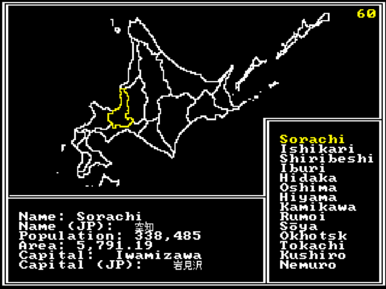

# Hokkaido Map

A little interactive map of Hokkaido. Used to learn a bit of Raylib. Some of the implementation is a bit sloppy, but it was a good base to build things off of. Error handling could have been done a bit better.

## Known issues
- This program does appear to leak a small ammount of memory with the GLFW backend, though this is documented in the following [issue](https://github.com/raysan5/raylib/issues/3570)
- The system for parsing data (based on the Dwarf Fortress data files) is incomplete. Having the EOF character on the same line as the last entry will throw out that entry. I don't think i'll fix this and probably stick to something like CJson in the future.

## Credits
- [IBM Bios font](https://int10h.org/oldschool-pc-fonts/fontlist/?1#ibm-bios) 
- [Bestten font](http://mplus-fonts.sourceforge.jp/mplus-outline-fonts/)